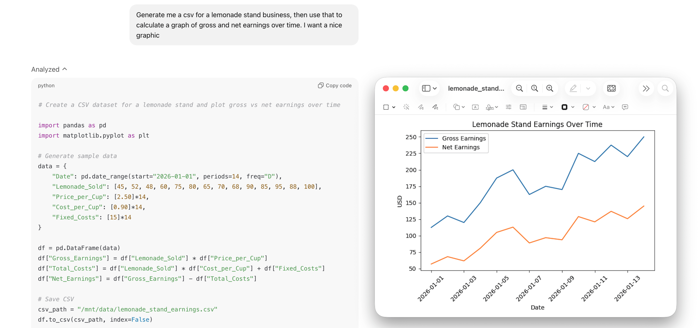

# Code Interpreter

A secure service for executing untrusted Python code in isolated Docker containers. This service provides a REST API for running code with strict resource limits, timeout controls, and file handling capabilities.

Everything runs locally and the execution environment comes pre-packaged with a list of common Python libraries.

This project aims to be the easiest, lightest weight way to add secure Python execution to your AI agent.



## How it works

The security first architecture and an overview of the implementation can be found [here](HOW_IT_WORKS.md).

## Quick Start

> Note: This repo powers the Code Interpreter feature in [Onyx](https://github.com/onyx-dot-app/onyx).
Check out the implementation [here](https://github.com/onyx-dot-app/onyx/tree/main/backend/onyx/tools/tool_implementations/python) as a reference for using it in your app.

### Docker Deployment

#### Option 1: Docker-out-of-Docker (Recommended)

This is the recommended approach for most use cases. This shares the host's Docker daemon for better performance to spin up and manage the ephemeral code execution containers.

```bash
docker run --rm -it \
  --user root \
  -p 8000:8000 \
  -v /var/run/docker.sock:/var/run/docker.sock \
  onyxdotapp/code-interpreter
```

**When to use:**
- You have access to the host Docker socket
- You want better performance and faster startup times
- You're running in a trusted environment

**Note:** Requires `--user root` to access the Docker socket. The executor image will be pulled at runtime if not already present on the host.

#### Option 2: Docker-in-Docker

Use this when you need complete isolation or can't access the host Docker socket. This runs a separate Docker daemon in a container to manage the code execution containers.

```bash
docker run --rm -it \
  --privileged \
  -p 8000:8000 \
  onyxdotapp/code-interpreter
```

**When to use:**
- You need complete isolation between the service and host
- You can't or don't want to mount the host Docker socket
- You're running in a restricted environment

**Important notes:**
- Requires `--privileged` flag
- The Docker daemon will automatically start inside the container (takes a few seconds)
- On first run, the executor image will be pulled during server startup (~30-60 seconds)
- Subsequent runs will reuse the cached image (instant startup)
- The server will not accept requests until the executor image is available

### Kubernetes Deployment

See [here](kubernetes/code-interpreter/README.md) for Helm and K8s deployment instructions

## API Usage

NOTE: for full API docs, start the service up and visit `/docs`. 

### Execute Python Code

```bash
POST /v1/execute
```

**Request:**
```json
{
  "code": "print('Hello, World!')\n2 + 2",
  "stdin": null,
  "timeout_ms": 2000,
  "last_line_interactive": true,
  "files": []
}
```

**Response:**
```json
{
  "stdout": "Hello, World!\n4\n",
  "stderr": "",
  "exit_code": 0,
  "timed_out": false,
  "duration_ms": 145,
  "files": []
}
```

### File Management

Upload a file for use in code execution:

```bash
POST /v1/files
Content-Type: multipart/form-data

# Upload file
curl -X POST http://localhost:8000/v1/files \
  -F "file=@data.csv"
```

Use uploaded files in execution:

```json
{
  "code": "import pandas as pd\ndf = pd.read_csv('data.csv')\nprint(df.head())",
  "files": [
    {
      "path": "data.csv",
      "file_id": "uuid-from-upload-response"
    }
  ]
}
```

Retrieve generated files:

```bash
GET /v1/files/{file_id}
```

List all files:

```bash
GET /v1/files
```

Delete a file:

```bash
DELETE /v1/files/{file_id}
```

## Configuration

Configure the service via environment variables:

- `HOST`: Server host (default: `0.0.0.0`)
- `PORT`: Server port (default: `8000`)
- `MAX_EXEC_TIMEOUT_MS`: Maximum execution timeout in milliseconds (default: `10000`)
- `CPU_TIME_LIMIT_SEC`: CPU time limit per execution (default: `5`)
- `MEMORY_LIMIT_MB`: Memory limit per execution (default: `128`)
- `MAX_OUTPUT_BYTES`: Maximum output size (default: `1048576` = 1MB)
- `MAX_FILE_SIZE_MB`: Maximum file upload size (default: `10`)
- `FILE_STORAGE_DIR`: Directory for file storage (default: `/tmp/code-interpreter-files`)

## Security

- All code execution happens in isolated environments
- Strict resource limits prevent resource exhaustion
- No direct filesystem access to host system
- Configurable timeouts prevent infinite loops
- Output size limits prevent memory attacks
- File uploads are validated and size-limited

## License

MIT License - see [LICENSE](LICENSE) file for details.

Copyright (c) 2025-present DanswerAI, Inc.
